# Project View Image

## Home page

## Registration Page
### It has Admin, Customer, Company and Employee
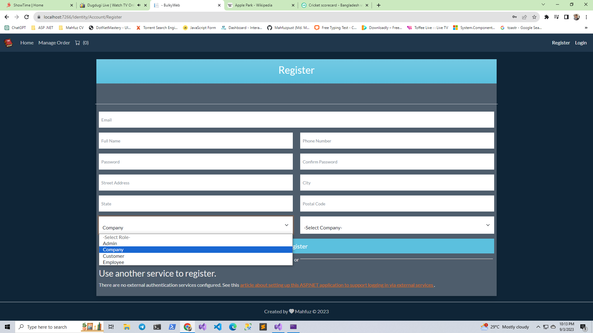

## Login Page
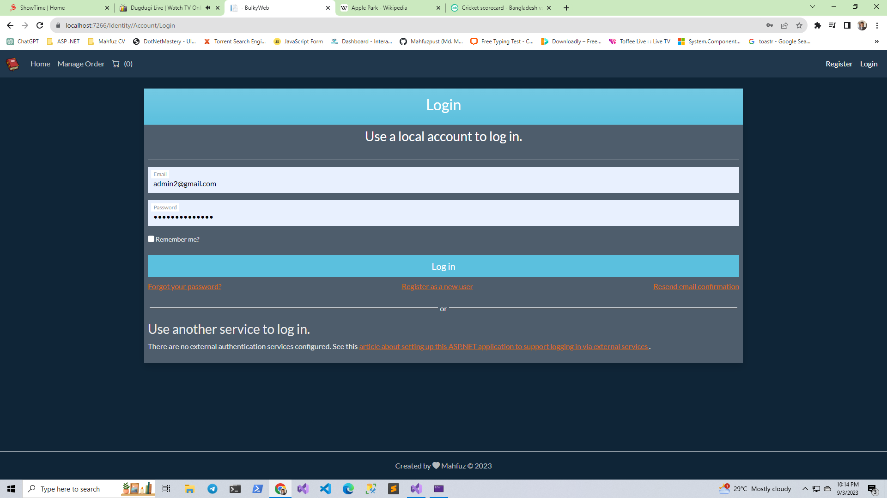

## Home Page (Customer Login)
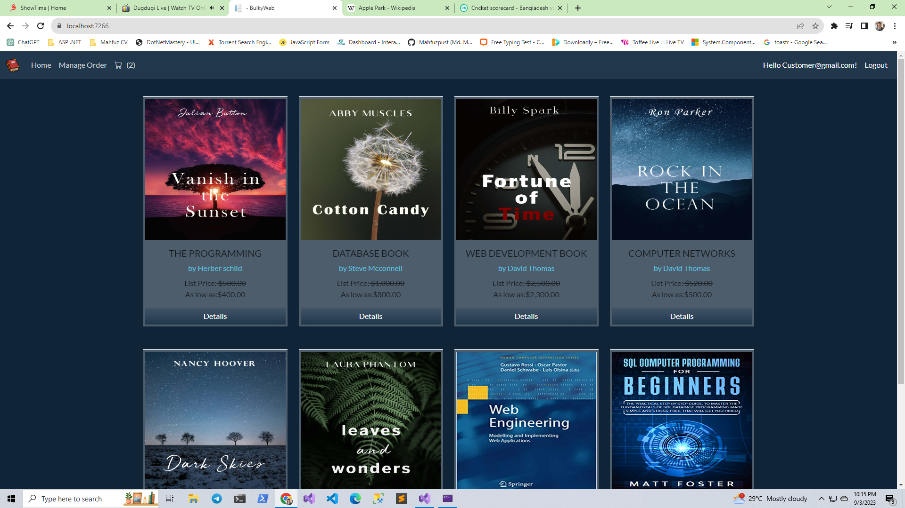

## Shopping Cart Page
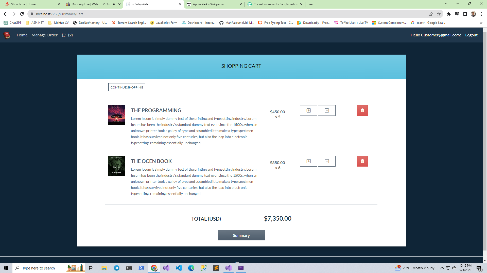

## Shipping details & Order Summary
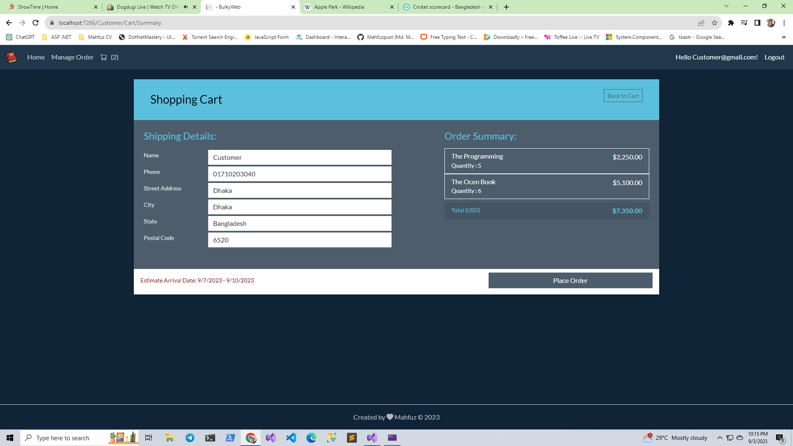

## Category page
### That control from Admin
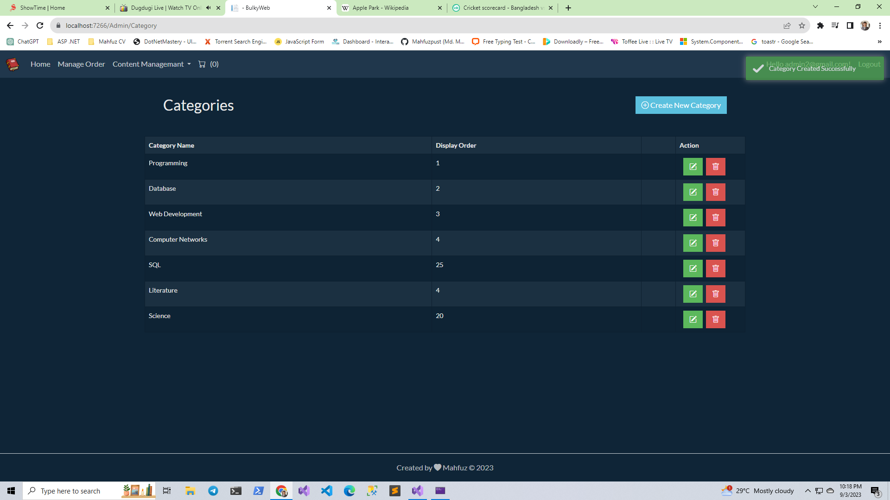

## Product page
### That control from Admin
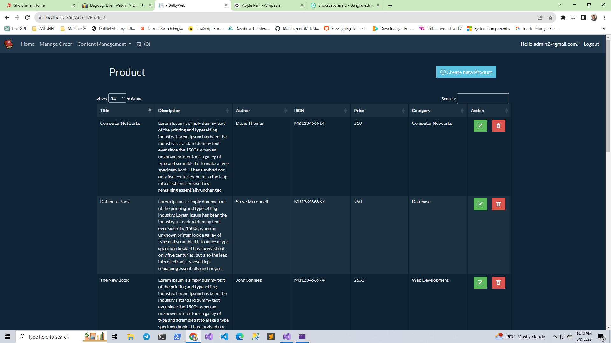

## Company page
### That control from Admin & Company
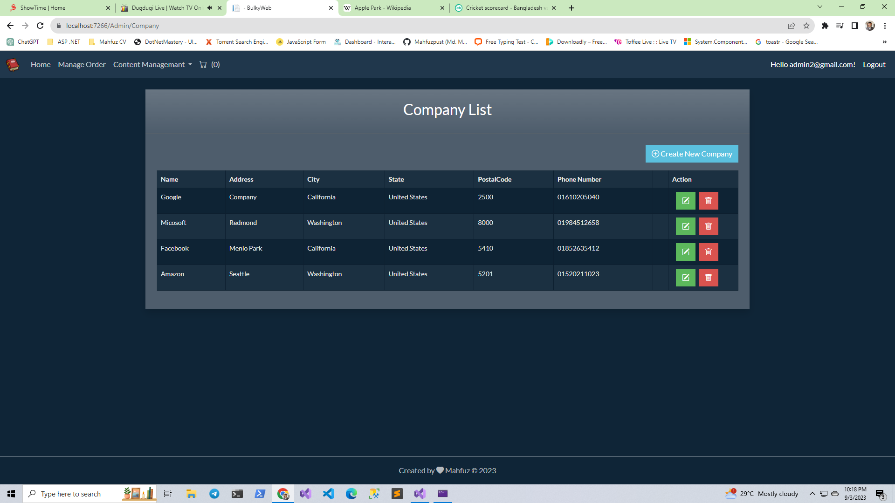

## Order List
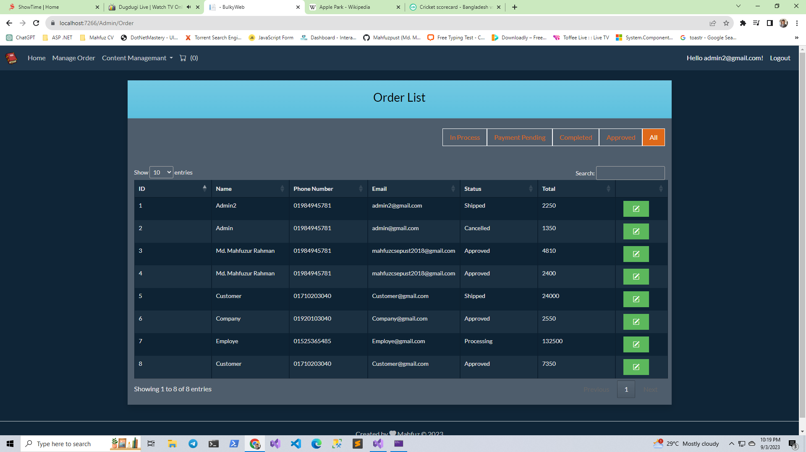

## Order Process, Approved, Shipping and Cancel 
### That Control only Admin
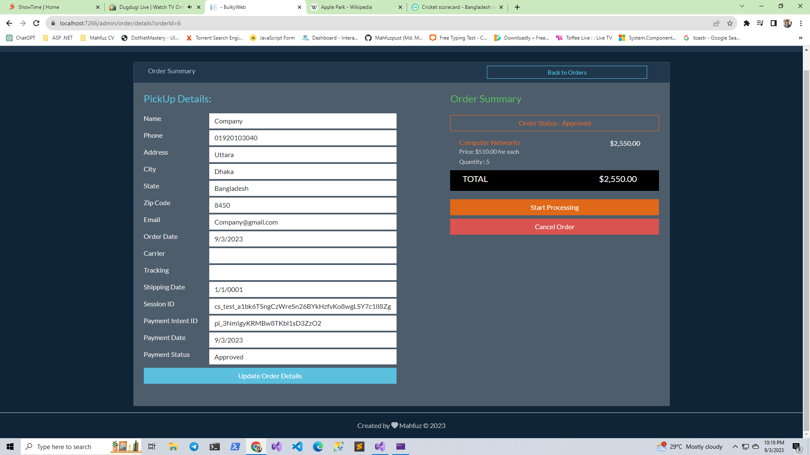
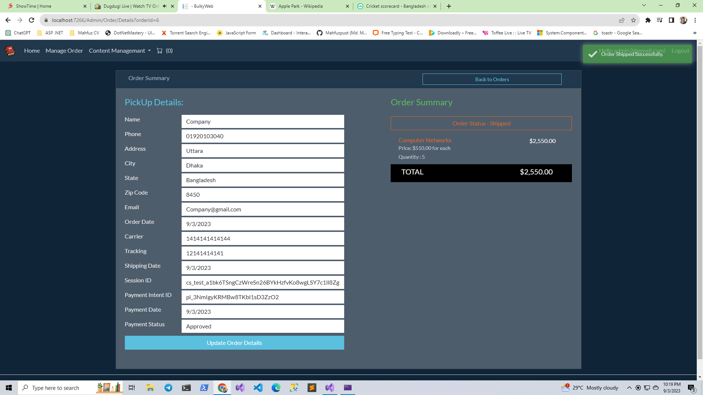

## Admin can handle User Account 
### If any user can fault then Admin can LOCK these account and remove LOCK also acccess or permission.
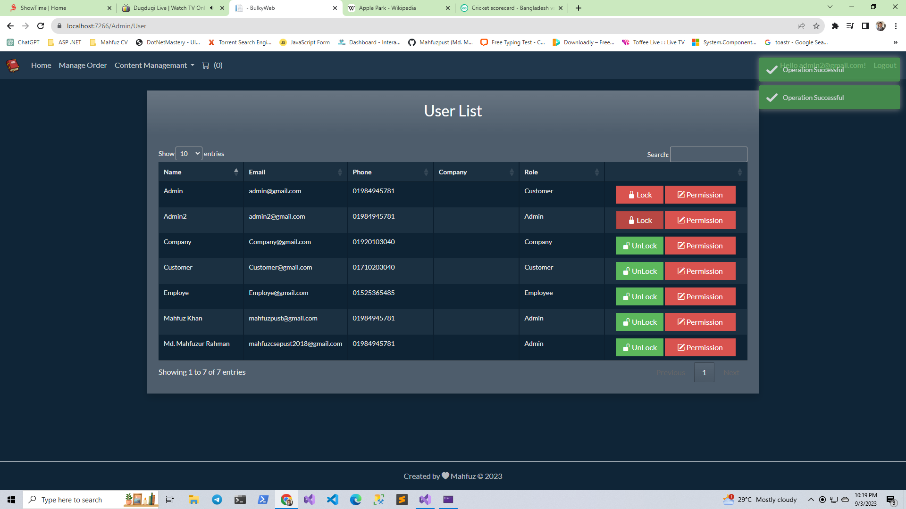

